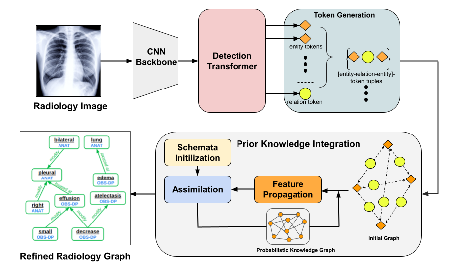

# Prior-RadGraphFormer: A Prior-Knowledge-Enhanced Transformer for Generating Radiology Graphs from X-Rays
[[`arXiv`](https://arxiv.org/abs/2303.13818)]
[[`BibTex`](#citation)]
[[`Paper`](https://link.springer.com/chapter/10.1007/978-3-031-55088-1_5)]

Yiheng Xiong*, [Jingsong Liu*](https://tumvink.github.io/), [Kamilia Zaripova*](https://scholar.google.com/citations?user=ZQ1CQkQAAAAJ&hl=en), [Sahand Sharifzadeh](https://scholar.google.de/citations?user=frzfxXYAAAAJ&hl=en), [Matthias Keicher†](https://www.cs.cit.tum.de/camp/members/matthias-keicher/) and [Nassir Navab†](https://www.cs.cit.tum.de/camp/members/cv-nassir-navab/nassir-navab/)

(* denotes equal contribution and † denotes shared last authorship)

Official implementation for MICCAI Workshop on GRaphs in biomedicAl Image anaLysis (GRAIL) 2023 paper "Prior-RadGraphFormer: A Prior-Knowledge-Enhanced Transformer for Generating Radiology Graphs from X-Rays".


Prior-RadGraphformer is a transformer-based network aiming at directly generating radiology graphs from radiology X-rays. Generated graphs can be used for multiple downstream tasks such as free-text reports generation and pathologies classification.

# Installation
We recommend using python3.8 and following scripts to install required python packages and compile CUDA operators
```
python -m venv /path/to/new/virtual/environment
source /path/to/new/virtual/environment/bin/activate
pip install -r requirements.txt

cd ./models/ops
python setup.py install
```

# How to train the Prior-RadGraphFormer

## Preparing the data
See details [here](preprocess/readme.md).

## Preparing the config file
The config file can be found at `.configs/radgraph.yaml`. Make custom changes if necessary. Specifically, to train a vanilla RadGraphFormer, set MODEL.ASM=False.

## Training
```
python train.py
```
## Visualization
Run <code>python util/viz_graph.py</code>, you may need to edit the dir though.

## Downstream tasks evaluation
See details [here](postprocess/readme.md).

## Pretrained checkpoints
[checkpoint](https://cloudstore.uni-ulm.de/s/ckz4FC976tikEWX)

# <a name="citation"></a> Citation

If you find this code helpful, please consider citing and giving our code repository a star ⭐️:
```BibTeX
@inproceedings{xiong2023prior,
  title={Prior-RadGraphFormer: A Prior-Knowledge-Enhanced Transformer for Generating Radiology Graphs from X-Rays},
  author={Xiong, Yiheng and Liu, Jingsong and Zaripova, Kamilia and Sharifzadeh, Sahand and Keicher, Matthias and Navab, Nassir},
  booktitle={International Conference on Medical Image Computing and Computer-Assisted Intervention},
  pages={54--63},
  year={2023},
  organization={Springer}
}
```

# Acknowledgement
This code borrows heavily from [Relationformer](https://github.com/suprosanna/relationformer/tree/scene_graph), [Classification by Attention](https://github.com/sharifza/schemata). We thank the authors for their great work.

The authors gratefully acknowledge the financial support by the Federal Ministry of Education and Research of Germany (BMBF) under project DIVA (FKZ 13GW0469C). Kamilia Zaripova was partially supported by the Linde & Munich Data Science Institute, Technical University of Munich Ph.D. Fellowship.
